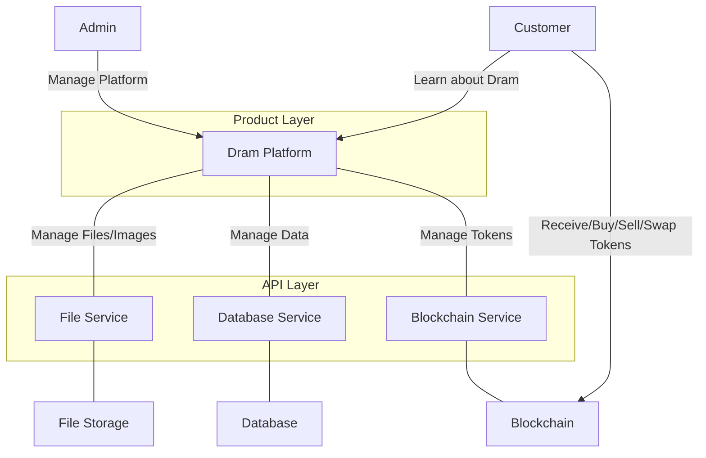

# Dram


### Business Objectives

The project aims to innovate the Scottish whiskey industry by fictionalising
cask investing using
semi-fungible token technology. It provides a secure, transparent, and
efficient solution for buying, selling, and investing in whiskey casks with a low barrier; to entry and return on investment.

The business objectives are

- Bring new users into the crypto ecosystem and a portion real GDP from the £7.1bn scottish whisky industry
- Bring new investment into the Whiskey industry by providing a ramp from the multi trillion dollar
  crypto market
- Enhance the profile of the Scottish Whiskey industry internationally
- Provide a high-quality, relatively stable investment vehicle for crypto investors
- Lower financial barriers to entry by fictionalising whiskey casks investments
- Provide a gateway for whisky investors to meet like-minded communities.
- Provide users with the status and novelty of owning an exiting asset
- Allow self-custody of digital assets, which are transferable liquid assets

*note: The software being developed is asset agnostic, it could be used for other use cases other
than whiskey investment and has value as a SAAS platform or re-sale of source code.*

## Architecture Overview

See the [statement of requirements](docs/statement-of-requirements.md) driving development of this
project.

---

### Overview - System-as-is



### Components

- Rest client running in test execution environment, pointing to local running application.
- Web 3 wallet running in the clients browser and local network
- Dram responsible for orchestrating operations
- A database responsible for extended data persistence locally
- A file storage service responsible for writing and maintaining files to a in local memory file system
- A blockchain running locally with Anvil, responsible for hosting NFT and Sale smart contracts

###     


### Getting Started

To get started with the project, follow these steps:

## 1. Run the docker compose file

## 2. Start Anvil

```bash
anvil --fork-url https://api.avax.network/ext/bc/C/rpc --block-time 5
```
#
forge build --silent && jq '.abi' ./solidity/SemiFungibleAsset/SemiFungibleAsset.json

forge inspect SemiFungibleAssetSale.sol abi --json > SemiFungibleAssetSale.json

solcjs --abi src/main/solidity/SemiFungibleAssetSale.sol -o build