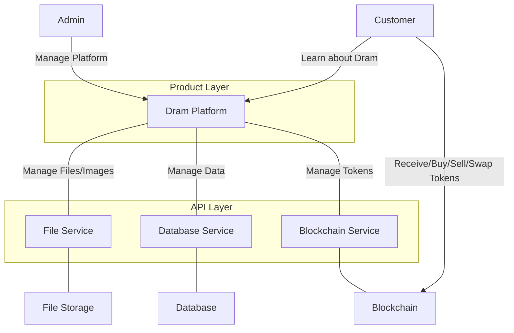

# Dram


### Business Objectives

The project aims to innovate the Scottish whiskey industry by fictionalising
cask investing using
semi-fungible token technology. It provides a secure, transparent, and
efficient solution for buying, selling, and investing in whiskey casks with a low barrier to entry and return on investment.

The business objectives are

- Bring new users into the crypto ecosystem and a portion of real GDP from the £7.1bn Scottish whisky industry
- Bring new investment into the Whiskey industry by providing a ramp from the multi-trillion dollar
  crypto market
- Enhance the profile of the Scottish Whiskey industry internationally
- Provide a high-quality, relatively stable investment vehicle for crypto investors
- Lower financial barriers to entry by fictionalising whiskey casks investments
- Provide a gateway for whisky investors to meet like-minded communities
- Provide users with the status and novelty of owning an existing asset
- Allow self-custody of digital assets, which are transferable liquid assets

*note: The software being developed is asset agnostic; it could be used for other use cases other
than whiskey investment and has value as a SAAS platform or resale of source code.*


Business Model Overview
1. Asset Sourcing & Vetting
Company scouts and selects assets expected to appreciate in value over time (e.g., rare spirits, fine wines, artworks, luxury collectibles).

Each asset undergoes due diligence to assess potential yield.

2. Tokenized Fractional Offering
The asset is not purchased upfront.

Instead, the platform lists the asset with a total number of fractional ownership tokens representing 100% of the future ownership.

Investors can purchase one or more tokens.

Only if all tokens are sold the asset is actually purchased from the seller.

If the offering fails to sell out, the asset is not purchased, and funds are returned (or not charged, depending on payment flow).

3. Ownership Structure
Once the asset is purchased, each token corresponds to a fractional co-ownership interest.

The asset is stored securely in an insured vault (“caveau”).

Exclusive Access Policy:

Investors holding at least 20% of the total tokens for a given asset may request an in-person viewing.

This is to prevent overcrowding and preserve security.

4. Holding Period
Asset is held for a predetermined period (the “expiration date” of the investment).

During this time, the asset remains under custody and is not used, to preserve its condition and value.

5. Liquidation & Profit Distribution
At the expiration date, the company sells the asset at the best possible price.

Profits: Distributed proportionally among token holders.

Losses: Deducted from each holder’s redeemable amount proportionally.

6. Revenues
The company applies a 2% fee on every buy and sell transaction of the tokens.

7. Key Differentiators
Risk mitigation: The Asset is only purchased if fully funded; otherwise, the token purchaser of the unfulfilled bid are fully refunded with no fees.

Transparency & exclusivity: Token holders can verify the existence and condition of the asset (with restrictions).

Specialized sourcing: In-house scouting ensures only high-potential goods are listed.
Diversification: Accessing alternative investments whose value can be unrelated to the stock market and is a good instrument of diversification. 

8. Compliance considerations:
In the European Union, the tokens that represent fractional ownership of an asset held to generate profit will be treated as securities (i.e., “transferable securities” or MiFID II instruments) In the EU, MiFID II / national securities law applies.
As soon as a bid is fulfilled, a SPV is created, and the SPV is fully related to each different asset that we plan to the underlying asset. The token purchased represent in fact the equity of the SPV created.
The SPV created will be a Lithuania incorporated company, with time of incorporation of about 24 hours. The SPV will appear as “asset wrapper”
You incorporate a Lithuanian private limited company as a Special Purpose Vehicle.
This SPV is created for one asset only — e.g., “WineSPV 2025-001”.
The SPV’s balance sheet has:
Assets: the physical good (wine, art, whisky cask, etc.).
Liabilities: none (ideally), except maybe small accounts payable for custody fees.
Equity: shareholders’ capital — this is what investors buy.


## Architecture Overview

See the [statement of requirements](docs/statement-of-requirements.md) driving development of this
project.

---

### Overview - System-as-is



### Components

- Rest client running in test execution environment, pointing to local running application.
- Web 3 wallet running in the clients browser and local network
- Dram responsible for orchestrating operations
- A database responsible for extended data persistence locally
- A file storage service responsible for writing and maintaining files to a in local memory file system
- A blockchain running locally with Anvil, responsible for hosting NFT and Sale smart contracts

###     


### Getting Started

To get started with the project, follow these steps:

## 1. Run the docker compose file

## 2. Start Anvil

```bash
anvil --fork-url https://api.avax.network/ext/bc/C/rpc --block-time 5
```
#
forge build --silent && jq '.abi' ./solidity/SemiFungibleAsset/SemiFungibleAsset.json

forge inspect SemiFungibleAssetSale.sol abi --json > SemiFungibleAssetSale.json

solcjs --abi src/main/solidity/SemiFungibleAssetSale.sol -o build
