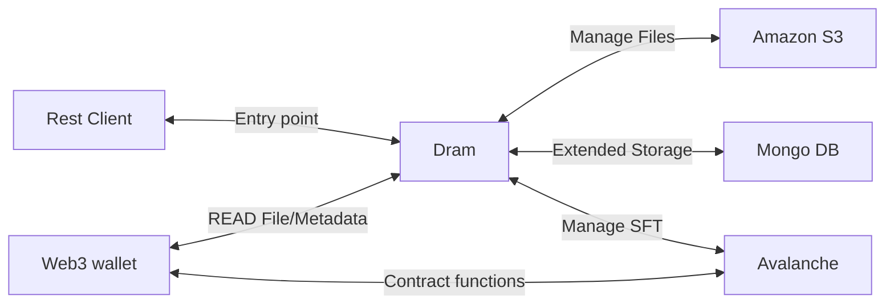

# Dram

### Business Objectives

whiskey
The project aims to innovate the Scottish whiskey industry by fictionalising whiskey bonds using
semi-fungible token technology. It provides secure, transparent, and
efficient solutions for buying, selling, and investing in whiskey bonds with return on investment.

The business objectives are

- Bring new users into the crypto ecosystem and real GDP of 71bn GBP on-chain
- Bring new investment into the Whiskey industry by providing a ramp from the 3+ trillion dollar
  crypto market
- Enhance the profile of the Scottish Whiskey industry internationally
- Provide a high quality, relatively stable investment return to crypto investors
- Lower financial barriers to entry by fictionalising whiskey bonds
- Provide a gateway for whisky investors to meet like-minded communities.
- Provide users the status and novelty of owning an exiting asset
- Allow self-custody of bonds which are a transferable and liquid asset

*note: The software being developed is asset agnostic, it could be used for other use cases other
than whiskey bonds and has value as a SAAS platform or re-sale of source code.*

## Project Overview

See the [statement of requirements](docs/statement-of-requirements.md) driving development of this
project.

---

### Overview - System-as-is

### Components

- Rest client running in test execution environment, pointing to local running application.
- Web 3 wallet running in the clients browser and local network
- Dram Orchestrator responsible for coordinating transactions
- Mongo Db responsible for extended data persistence locally
- S3 service responsible for writing and maintaining files to a in local memory file system
- AVAX running locally with Anvil, responsible for maintaining NFT and Sale smart contracts

###   