# Tokenize Whiskey Investment

### Description

The following journey describes the process an Admin takes when tokenising an asset. Assets are
chosen by the Dram team and consumed into the custodian framework.
The details of the asset are uploaded into the Dram system and
composed into a form suitable to tokenization. The asset data is distributed onto a public file
system and the NFT is deployed onto the blockchain. Finally, a sale contract is deployed that allows
customers to
purchase the asset.

---

---

### Journey Description

#### <ins>Select Whiskey investment</ins>

The dram team selects a Whiskey investment available from the investment agent.

#### <ins>Custody</ins>

The admin ensures that the asset is held in custody by a trusted third party. This is important for
the security and integrity of the asset.
Is an LLC per investment suitable for the asset with respect to cost of maintenance?

#### <ins>Initialise Details</ins>

The admin uploads the details of the Whiskey investment into the Dram system. This includes the name,
description, and any other relevant information about the asset.

#### <ins>Deploy Asset</ins>

The admin retrieves the Whiskey investment and custodial information from the storage service and bundles
it into a data package suitable for creating an NFT. This includes the asset's metadata, custodian
details, and any other relevant information.

#### <ins>Distribute data</ins>

The admin distributes the asset data into a public file system. This ensures that the asset's
metadata is accessible to anyone who wants to view it.

#### <ins>Deploy NFT</ins>

The admin deploys the NFT contract on the blockchain. This involves creating a smart contract that
represents the asset and its ownership.

##### <ins>Deploy NFT Sale</ins>

The admin deploys a sale contract that allows customers to purchase the asset. This contract
includes details about the sale, such as the price and any other relevant information.

--- 

### Use Cases

##### <ins>F1-AC Define Whiskey investment</ins>

An asset is defined when the business selects a Whiskey investment and forms an LLC to hold the legal
rights.
The Admin takes this information and uploads it into the Dram system to be used in the tokenization
process.

```mermaid

flowchart LR
    subgraph 'Define Whiskey investment'
        uc1((1-Select Whiskey investment))
        uc2((2-Custody))
        uc3((3-Upload Details))
    end

    usr["Admin 👤"]
    cs["Custodian"]
    bd["investment Agent"]
    ss["Data Storage"]
    usr ---> uc1
    usr ---> uc2
    usr ---> uc3
    uc1 ---> bd
    uc3 ---> ss
    uc2 ---> cs

```

##### <ins>F1-DF Tokenize Whiskey investment</ins>

An asset is tokenized when the Whiskey investment and LLC information is retrieved from the storage
service and bundled into a data package suitable for creating an NFT.

```mermaid

flowchart LR
    subgraph 'Tokenize Whiskey investment'
        uc1((1-Deploy Asset func))
        uc2((2-Distribute data))
        uc3((3-Deploy NFT))
        uc4((4-Deploy NFT Sale))
    end

    usr["Admin 👤"]
    st["Data Storage"]
    s3["File System"]
    bl["Blockchain"]
    usr ---> uc1
    uc1 ---> st
    uc2 ---> s3
    usr --> uc2
    usr --> uc3
    usr --> uc4
    uc3 --> bl
    uc4 --> bl
```

---

### Assumptions

- Extended NFT data is store in a distributed file system, no data about an asset is stored in the
  website code.