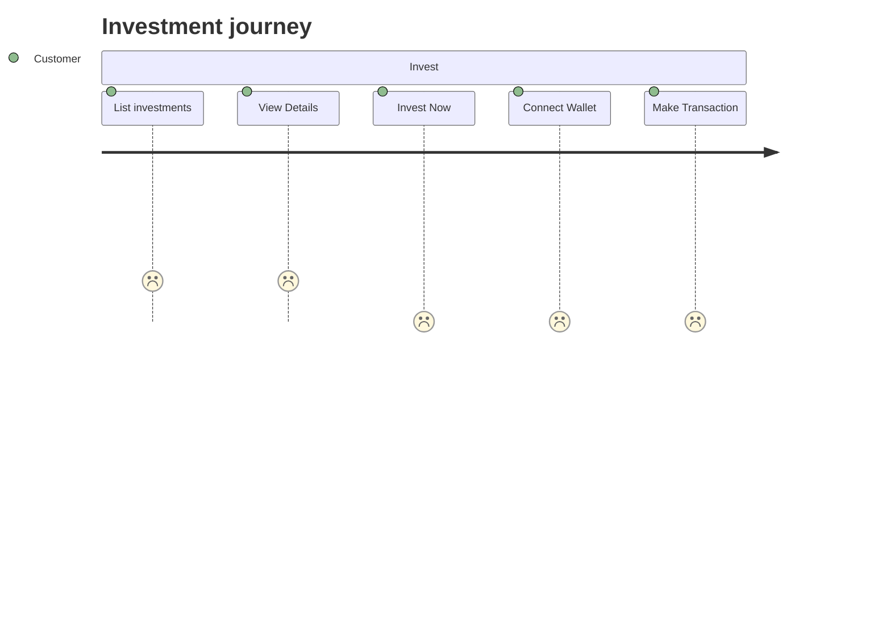

# Investment journey

### Description

The following journey describes the process a customer takes when investing in Dram assets

---

### Assumptions

- Access to assets on chain are whitelisted

---

---

### Journey Description

#### <ins>List investments</ins>

The customer is presented with a list of whiskey investments available for investment.

#### <ins>View Details</ins>

The customer can view the details of each investment.

#### <ins>Whitelist User *maybe*</ins>

The admin is responsible for whitelisting the user to allow them to invest in the asset.

#### <ins>Invest Now</ins>

The customer can proceed to invest in the asset.

#### Connect Wallet

The customer is prompted to connect their wallet to the platform.

#### Make Transaction

The customer can make a transaction to swap the asset and receives the asset into their wallet.

price floor/oracle