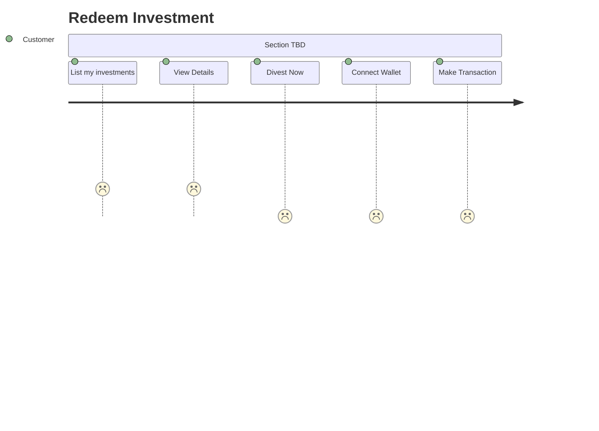

# Redeem Investment journey

### Description

The following journey describes the process a Customer takes to redeem their investment

### Assumptions

- This is a primary market feature and does not rely on the secondary market LP or grey market.

### Risks to the business

1. f-3 has associated risk from currency conversion
2. f-3 has associated liquidity risk
3. f-3 has associated regulatory risk
4. f-3 has associated custodial risk
5. f-3 has associated smart contract risk
6. f-3 has associated risk of impertinent loss if the asset is not held to term. 