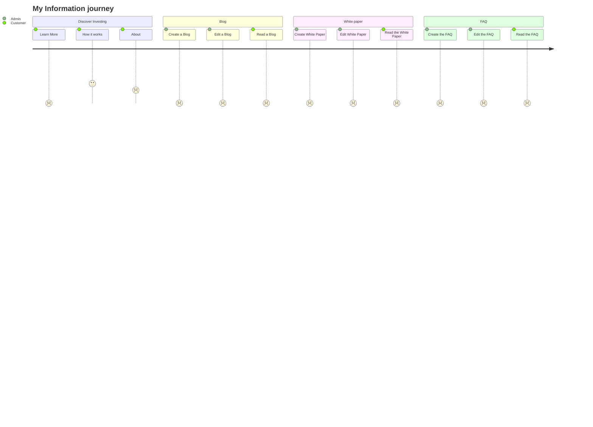

# Information journey

### Description

The following journey describes the process a customer uses to gain information about Dram

---

### Assumptions

- Information is dynamic and not hard coded into the website.

### Missing functionality

#### Learn More

- The link is dead
- The function is not clear

---

#### How it works

- The regulatory compliance section has no official documentation.
- The tokenization section has no open source Smart Contracts, Audits or standards described.

---

#### About

- Investors count is hard coded and should be a ticker?
- investments count is hard coded and should be a ticker?
- Whiskey investment Value is hard coded and should be a ticker?
- Main page footer link to 'about' is dead

---

#### Blog

- Link is dead
- The demo does not represent this process.

---

#### Whitepaper

- Link is dead
- The demo does not represent this process.

---

#### FAQ

- Link is dead
- The demo does not represent this process.