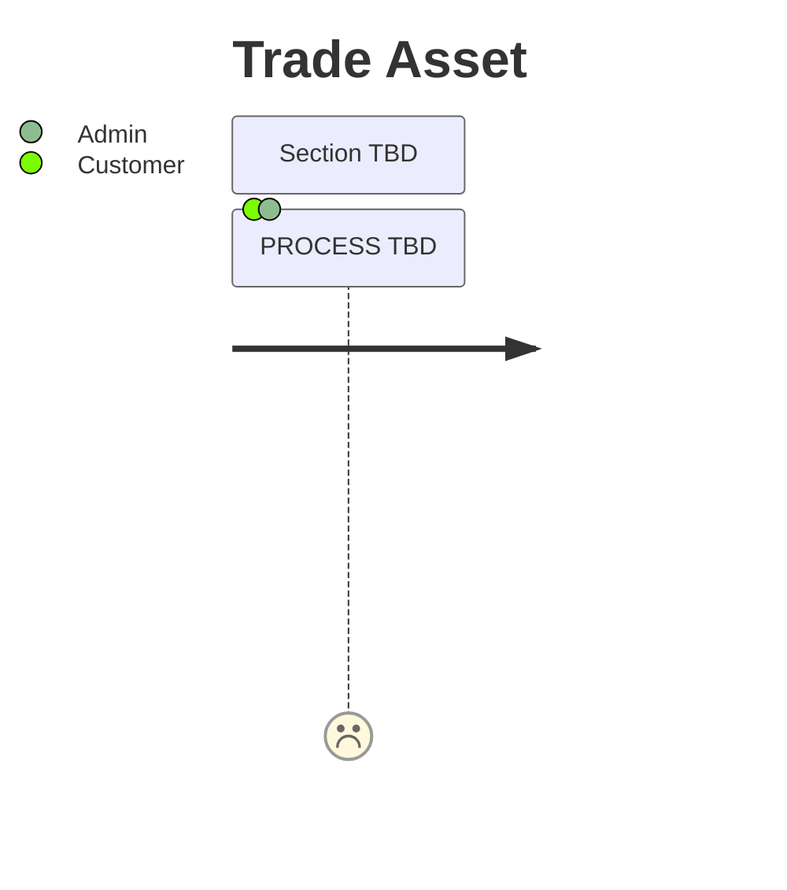

# Trade Asset journey

### Description

The following journey describes the process a Customer takes to trade an asset.

### Assumptions

- Trade is a secondary market provided by a managed Dram LP
- Trade does not refer to sending tokens between accounts or a grey market LP

### Missing functionality

#### Trade Asset

- The demo does not represent this process.