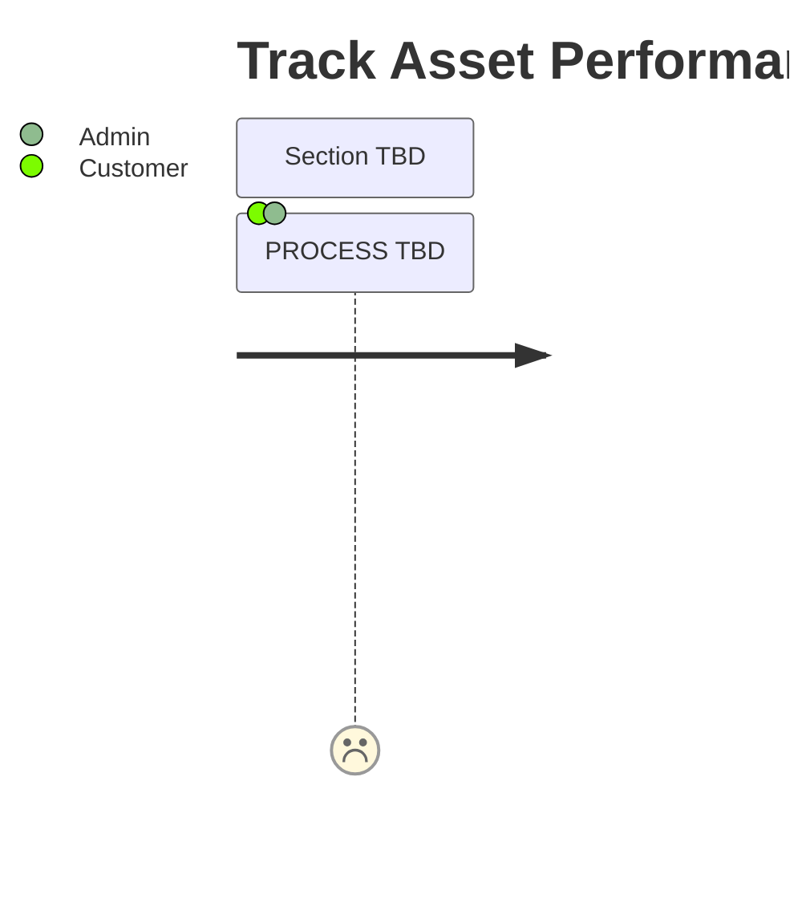

# Track Asset Performance journey

### Description

The following journey describes the process a Customer takes to track the performance of their
investments

### Assumptions

- An api will be exposed with real time asset values

### Missing functionality

#### Track Performance Asset

- The demo does not represent this process.