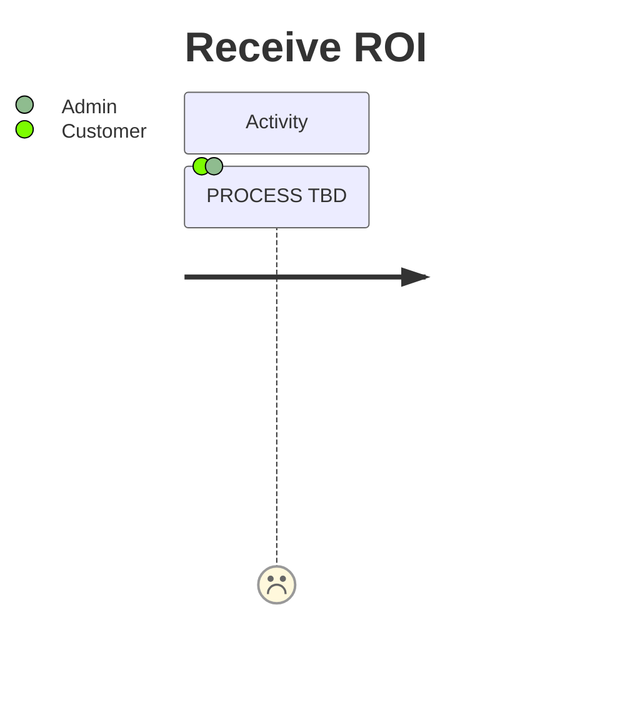

# Receive ROI

### Description

The following journey describes the process a Customer takes to receive their ROI.
example if the ROI is delivered via a smart contract raised floor price (number go up) or a
distribution of tokens.

---

### Assumptions

