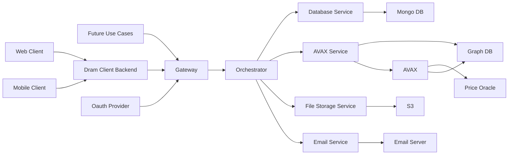

## System-to-be

The system to be supposes the final high level architecture of the system.

### Components

- Web Client running in the user web browser
- Mobile Client running in the web browser on a phone
- Client Back End responsible for providing the client to the user
- Public Gateway responsible for authenticating the backend and routing requests
- Orchestrator responsible for coordinating transactions
- Database Service responsible for data persistence and maintenance
- File Storage service responsible for writing and maintaining files to a cloud file system
- Email service responsible to sending emails to users
- AVAX service responsible for maintaining NFT and Sale smart contracts
- Graph DB responsible for taking snapshots of the contract state, reducing I/O with AVAX